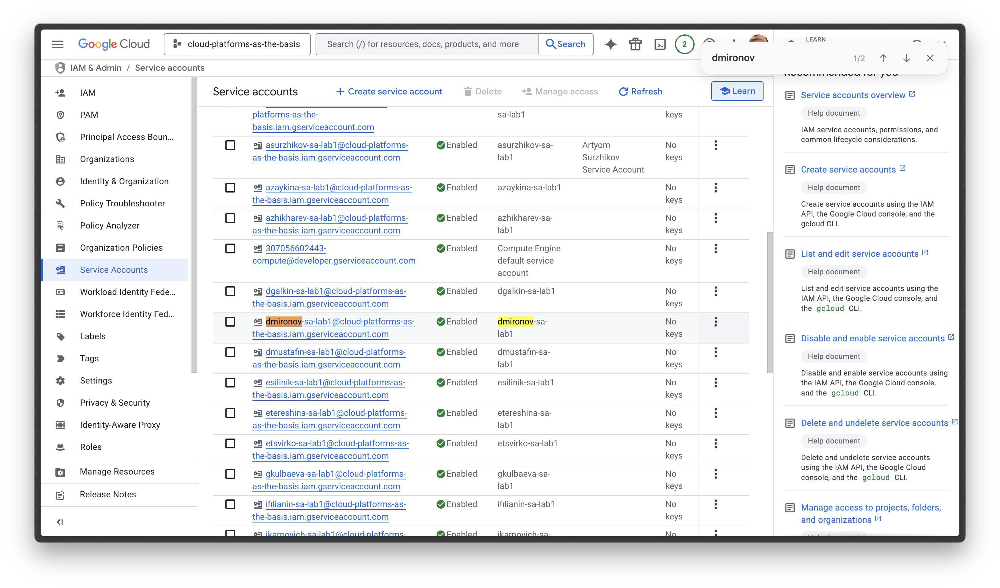
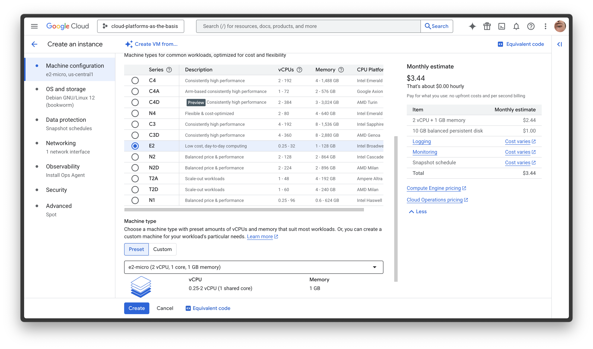
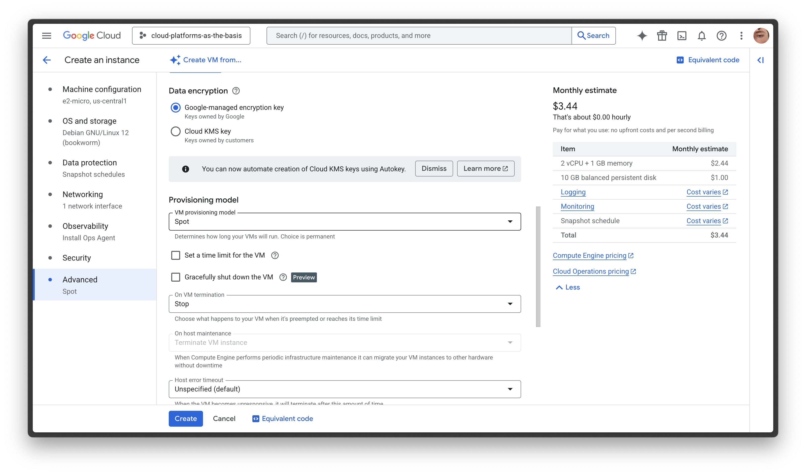
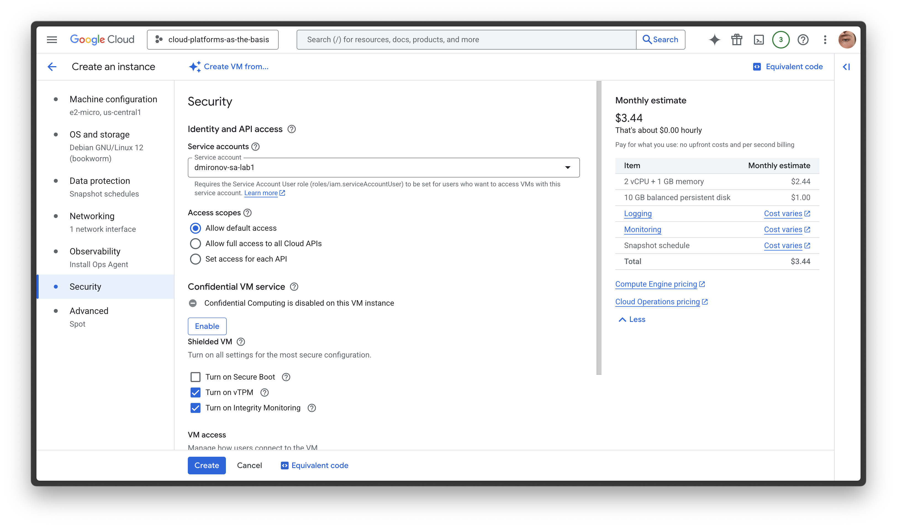
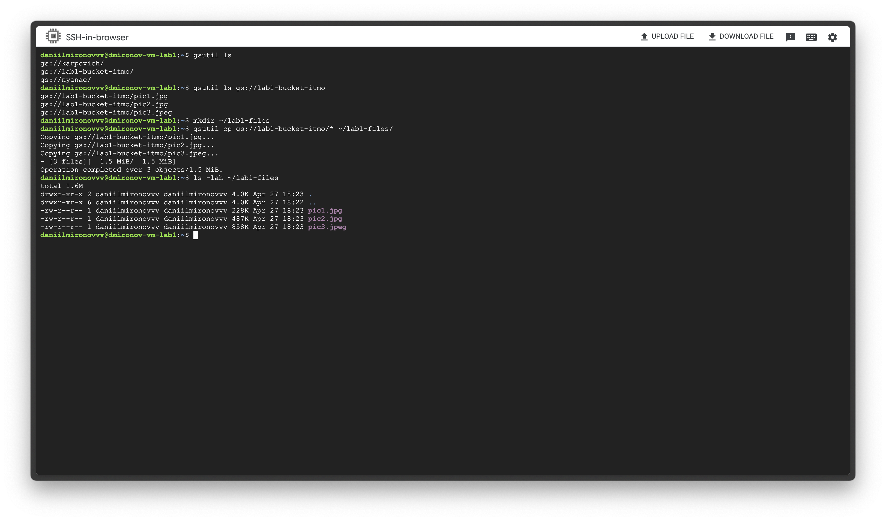
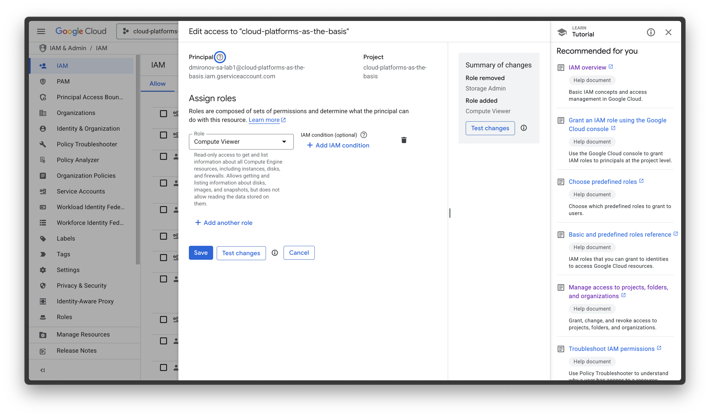
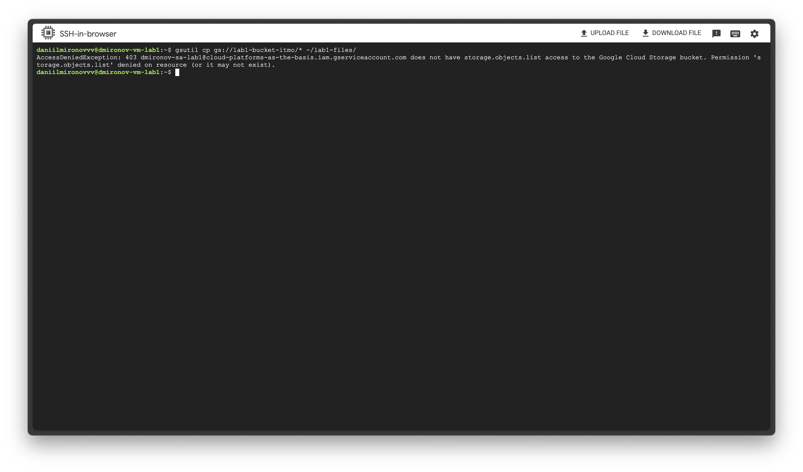

# Лабораторная работа №1 «Обзор Google Cloud и исследование основных сервисов»

**University:** [ITMO University](https://itmo.ru/ru/)  
**Faculty:** [FTMI](https://ftmi.itmo.ru)  
**Course:** [Cloud platforms as the basis of technology entrepreneurship](https://itmo-ict-faculty.github.io/cloud-platforms-as-the-basis-of-technology-entrepreneurship/)  
**Year:** 2024/2025  
**Group:** U4125  
**Author:** Mironov Daniil Gennadevich  
**Lab:** Lab1  
**Date of create:** 27.04.2025  
**Date of finished:** 

## Ход работы

### 1. Получение доступа к Google Cloud
- Заполнил гугл-форму и получил доступ к GCP.

### 2. Создание Service Account
- Создан сервисный аккаунт `dmironov-sa-lab1`.
- Назначена роль **Storage Admin**.

Скриншот создания аккаунта:  


### 3. Создание виртуальной машины
- Создана VM с именем `dmironov-vm-lab1`.
- Тип машины: `e2-micro`.
- Режим: `Spot`.

Скриншоты настройки VM:  
  


### 4. Привязка Service Account к VM
- Указан созданный сервисный аккаунт при создании VM.

Скриншоты настройки VM:  


- Доступ через SSH установлен.

### 5. Работа с Google Cloud Storage и утилитой `gsutil`

- Поиск бакета:

```bash
gsutil ls
```

- Создание директории и копирование файлов:

```bash
mkdir ~/labl-files
gsutil cp gs://lab1-bucket-itmo/* ~/labl-files/
ls -lah ~/labl-files
```

**Результат:**  
Файлы `pic1.jpg`, `pic2.jpg`, `pic3.jpeg` успешно скопированы на VM.

**Скриншот копирования файлов:**  


### 6. Изменение роли Service Account

- В IAM изменилась роль с **Storage Admin** на **Compute Viewer**.

**Скриншот изменения роли:**  


### 7. Повторная попытка копирования файлов

- Повтор команды:

```bash
gsutil cp gs://lab1-bucket-itmo/* ~/labl-files/
```

- Результат:

```plaintext
AccessDeniedException: 403 dmironov-sa-lab1@cloud-platforms-as-the-basis.iam.gserviceaccount.com does not have storage.objects.list access to the Google Cloud Storage bucket.
```

**Скриншот ошибки:**  


Изначально у Service Account'а (dmironov-sa-lab1) была роль Storage Admin, которая давала полный доступ (создание, чтение, удаление объектов в бакете Google Cloud Storage). После изменений аккаунту присвоили роль Compute Viewer, которая даёт только права на просмотр ресурсов Compute Engine, но не предоставляет доступ к работе с объектами в Google Cloud Storage.

