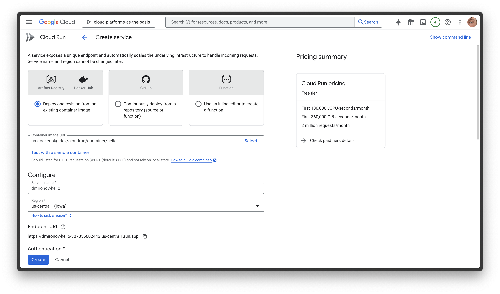
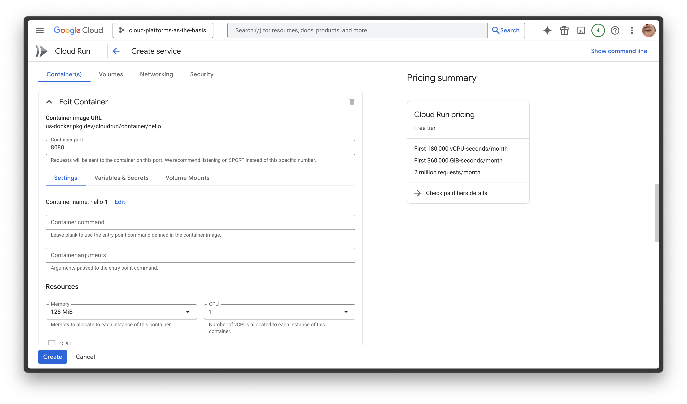
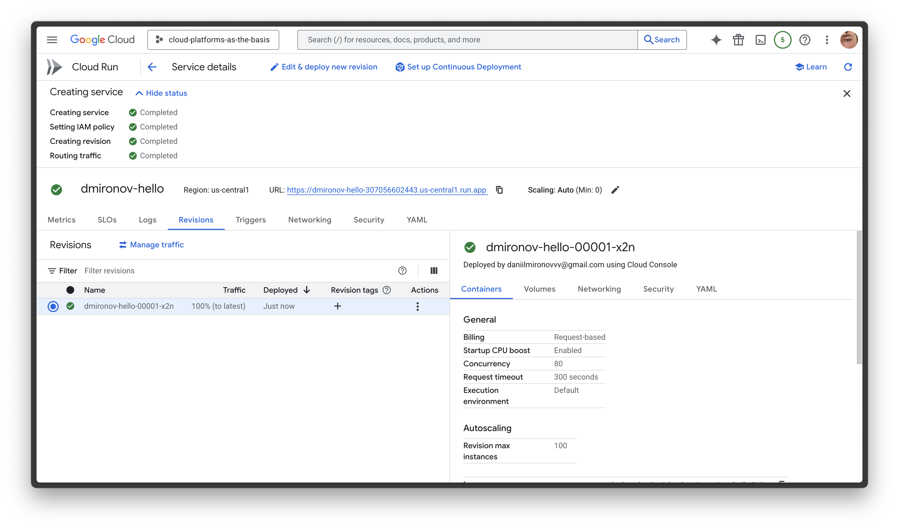
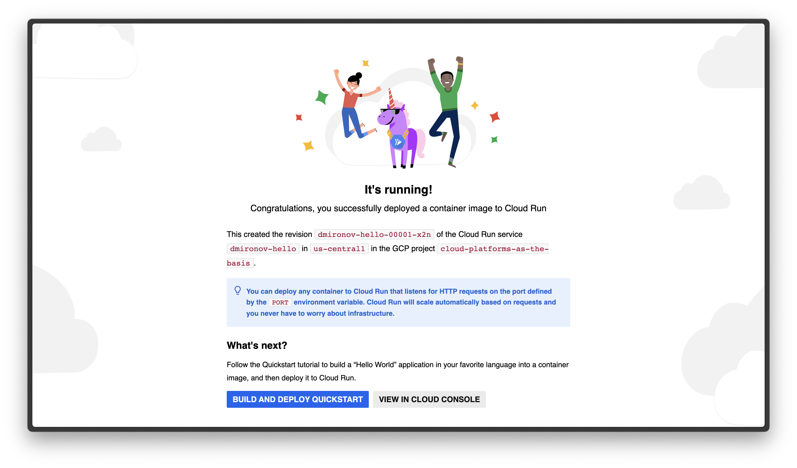
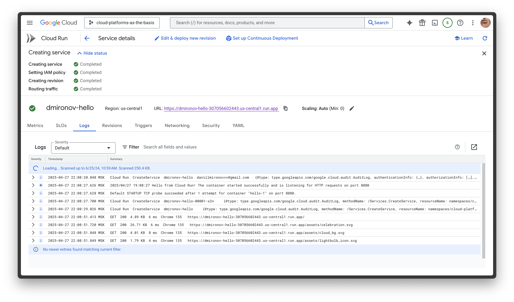
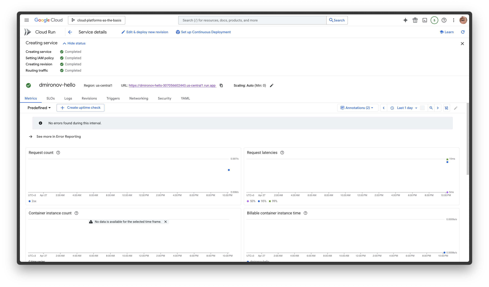
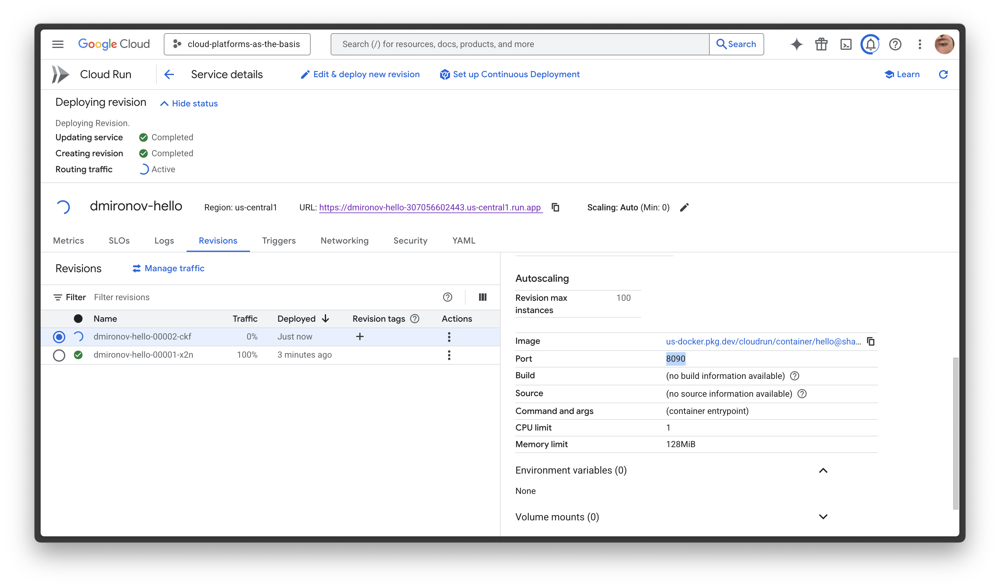
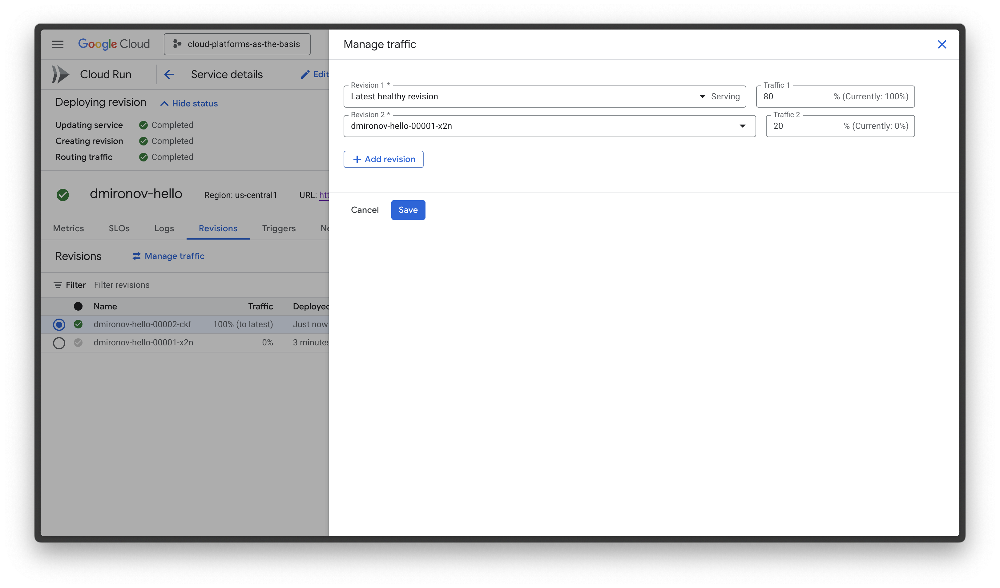
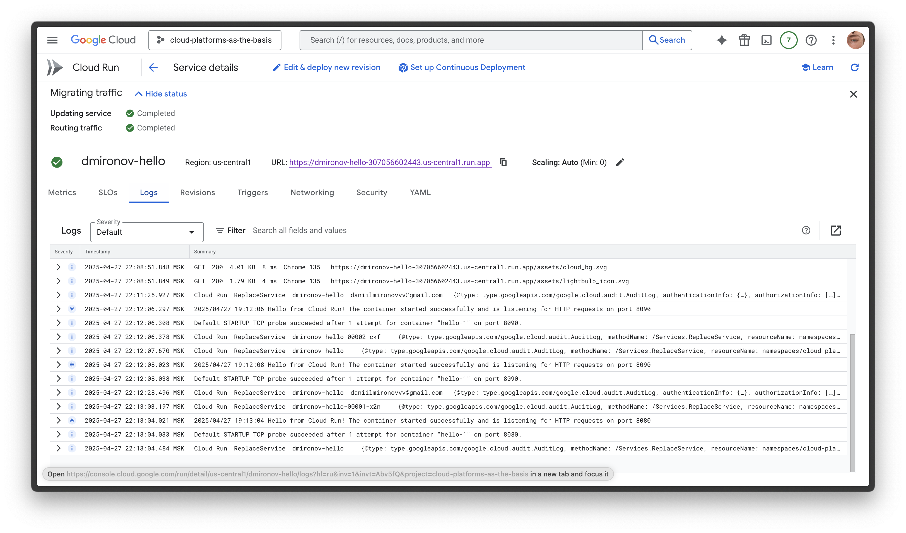

# Лабораторная работа №2 «Исследование Cloud Run»

**University:** [ITMO University](https://itmo.ru/ru/)  
**Faculty:** [FTMI](https://ftmi.itmo.ru)  
**Course:** [Cloud platforms as the basis of technology entrepreneurship](https://itmo-ict-faculty.github.io/cloud-platforms-as-the-basis-of-technology-entrepreneurship/)  
**Year:** 2024/2025  
**Group:** U4125  
**Author:** Mironov Daniil Gennadevich  
**Lab:** Lab2  
**Date of create:** 27.04.2025  
**Date of finished:** 

## Ход работы

### 1. Создание сервиса в Cloud Run

- Перешёл в Cloud Run в GCP.
- Создал новый сервис на основе дефолтного контейнера **Hello**.
- Минимальные ресурсы:
  - Память: 128 МБ
  - vCPU: 1
  - Порт: 8080
- Сервис назван `dmironov-hello`.

**Скриншоты создания сервиса:**  
  

### 2. Тестирование развернутого сервиса

- Перешёл по сгенерированной ссылке Cloud Run:  
  `https://dmironov-hello-307056602443.us-central1.run.app`
- Проверил, что сервис успешно запущен и отображает страницу приветствия.

**Скриншот успешного запуска:**  

### 3. Просмотр логов и метрик

- Перешёл в раздел **Logs** Cloud Run.
- Убедился, что сервис обрабатывает запросы на порт 8080.
- Перешёл в раздел **Metrics** для анализа количества запросов и времени отклика.

**Скриншоты логов и метрик:**  
  

**Логи:**
- Все входящие HTTP-запросы направлялись на порт **8080**.
- Контейнер успешно стартовал:  
  `Default STARTUP TCP probe succeeded on port 8080`.
- Все запросы обрабатывались без ошибок со статусом **200 OK**.
- Среднее время ответа: **4–6 мс**.

**Метрики:**
- Наблюдались успешные запросы со статусами **2xx**.
- Время отклика стабильно низкое — около **0.006–0.007 секунд**.
- Ошибок или сбоев в логах и метриках не зафиксировано.

### 4. Изменение порта и тестирование новой ревизии

- Создал новую ревизию сервиса.
- Изменил порт контейнера с 8080 на 8090.
- Выполнил деплой новой ревизии.

**Скриншот изменения порта:**  

### 5. Переключение трафика между ревизиями

- Настроил распределение трафика между ревизиями:
  - Старой (порт 8080) — 20%
  - Новой (порт 8090) — 80%
- Проверил доступность обоих версий.

**Скриншот управления трафиком:**  

### 6. Анализ логов после переключения

- Проанализировал, что запросы корректно маршрутизируются на обе ревизии.
- Логи зафиксировали корректную обработку запросов как на порт 8080, так и на 8090.

**Скриншот новых логов:**  

**Логи:**
- После изменения конфигурации контейнер стартовал на порту **8090**:  
  `Default STARTUP TCP probe succeeded on port 8090`.
- Все новые запросы направлены корректно на новый порт.
- Произошло событие пересоздания сервиса (`ReplaceService`), что является нормальным при смене конфигурации.
- Все ответы имели статус **200 OK**.

**Метрики:**
- Незначительное увеличение времени отклика сразу после деплоя новой ревизии из-за холодного старта контейнера.
- Среднее время ответа после изменения порта: **6–8 мс**.
- Продолжение стабильной обработки запросов без ошибок.

## Выводы

- Изменение порта никак не нарушило работоспособность сервиса.
- Cloud Run корректно пересоздал новую ревизию и переназначил endpoint без даунтайма.
- Небольшие всплески в метриках времени ответа сразу после деплоя новой ревизии являются нормой для serverless-архитектуры.
- Управление трафиком между ревизиями (split traffic) позволяет без потерь качества направлять пользователей на разные версии приложения для тестирования изменений.