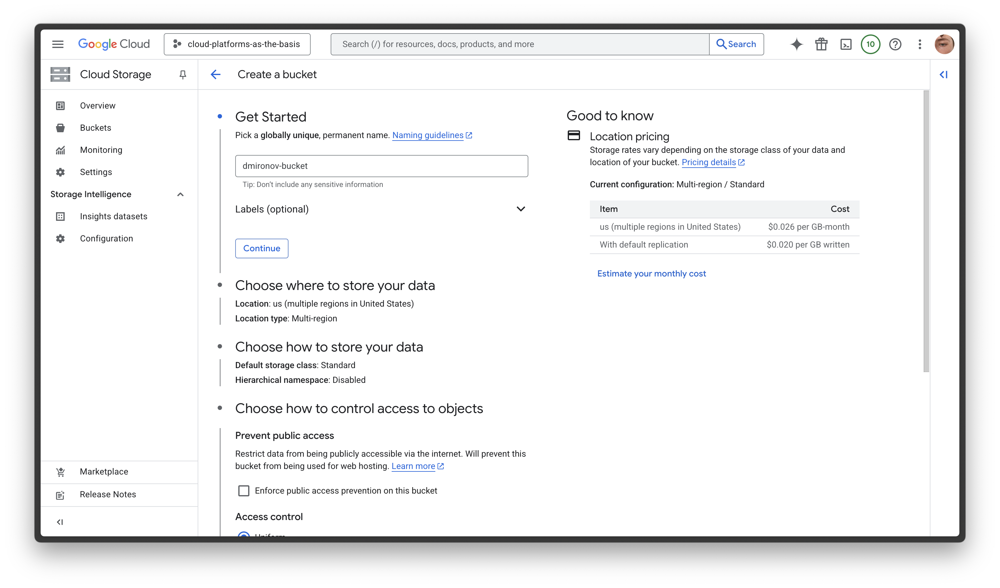
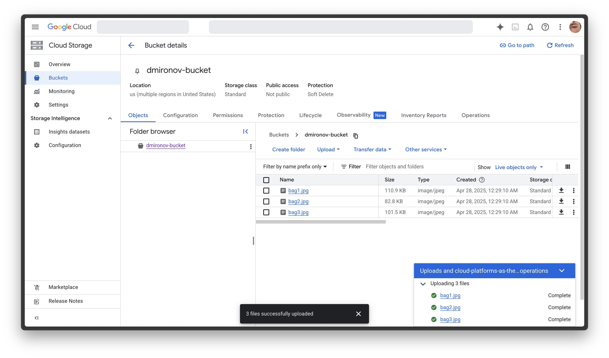
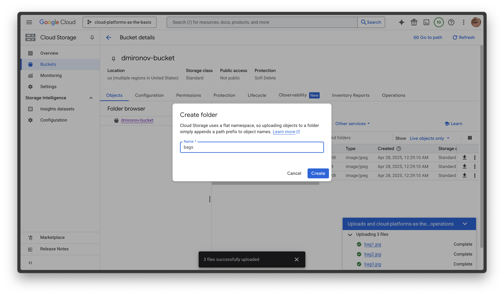
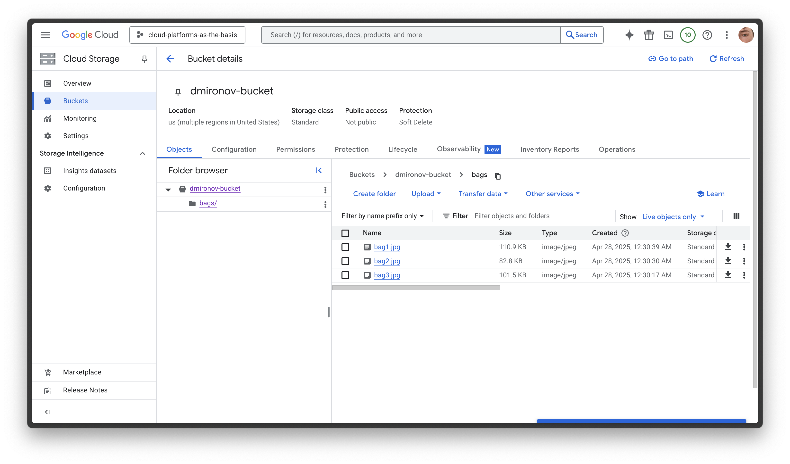
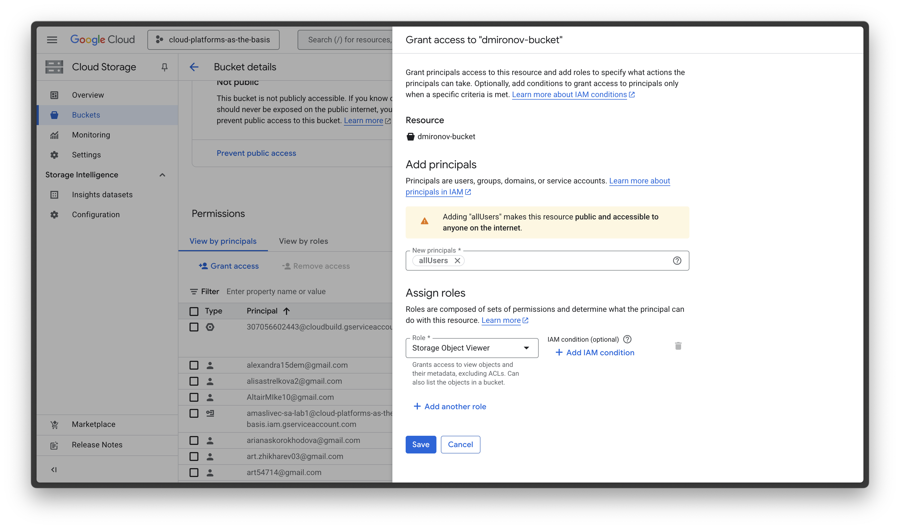
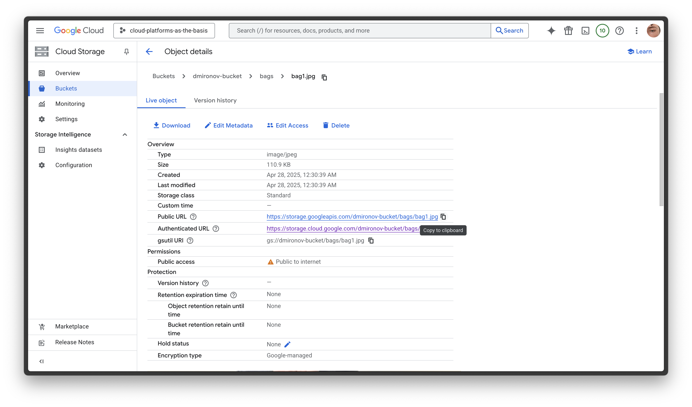
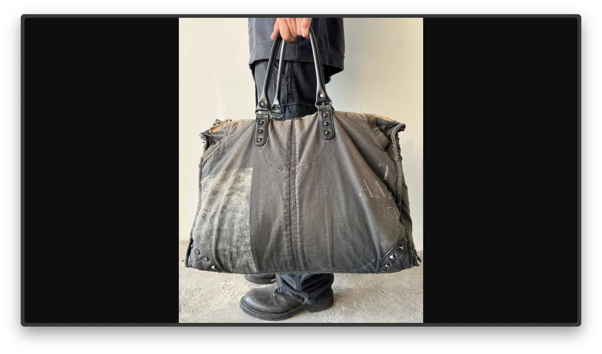
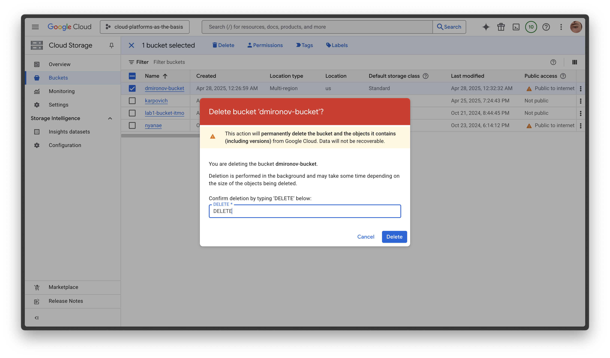

# Лабораторная работа №3 «Исследование Cloud Storage»

**University:** [ITMO University](https://itmo.ru/ru/)  
**Faculty:** [FTMI](https://ftmi.itmo.ru)  
**Course:** [Cloud platforms as the basis of technology entrepreneurship](https://itmo-ict-faculty.github.io/cloud-platforms-as-the-basis-of-technology-entrepreneurship/)  
**Year:** 2024/2025  
**Group:** U4125  
**Author:** Mironov Daniil Gennadevich  
**Lab:** Lab2  
**Date of create:** 28.04.2025  
**Date of finished:** 

## Ход работы

### 1. Выбор проекта

- Использован существующий проект `cloud-platforms-as-the-basis`, где имеются все необходимые разрешения для работы с Google Cloud Storage.

### 2. Создание Bucket в Cloud Storage

- Создан бакет с именем `dmironov-bucket`.
- Выбрана локация: `us` (мульти-регион в США).
- Класс хранения: `Standard`.

**Скриншот создания бакета:**  

### 3. Загрузка изображений в Bucket

- Загружены три файла:
  - `bag1.jpg`
  - `bag2.jpg`
  - `bag3.jpg`

**Скриншот после загрузки файлов:**  

### 4. Создание папки в Bucket и перемещение файлов

- Создана папка с именем `bags`.
- Все загруженные файлы перемещены в папку `bags`.

**Скриншот создания папки:**  

**Скриншот после перемещения файлов:**  

### 5. Настройка публичного доступа к файлам

- Для всех файлов предоставлены права публичного доступа через назначение роли **Storage Object Viewer** для группы `allUsers`.

**Скриншот настройки прав доступа:**  

### 6. Получение публичных ссылок на файлы

- Получены публичные ссылки для каждого файла через контекстное меню:
  - [bag1.jpg](https://storage.googleapis.com/dmironov-bucket/bags/bag1.jpg)
  - [bag2.jpg](https://storage.googleapis.com/dmironov-bucket/bags/bag2.jpg)
  - [bag3.jpg](https://storage.googleapis.com/dmironov-bucket/bags/bag3.jpg)

**Скриншот получения публичной ссылки:**  

### 7. Проверка доступности файлов

- Файлы успешно доступны через публичные URL без необходимости аутентификации.

**Скриншот просмотра файла bag1.jpg:**  

### 8. Удаление ресурсов

- Бакет `dmironov-bucket` удалён через консоль управления Google Cloud.

**Скриншот удаления бакета:**  
