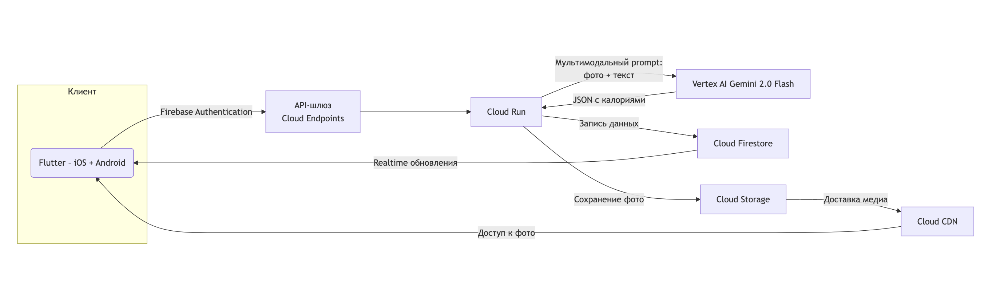

# Лабораторная работа №3 «Исследование Cloud Storage»

**University:** [ITMO University](https://itmo.ru/ru/)  
**Faculty:** [FTMI](https://ftmi.itmo.ru)  
**Course:** [Cloud platforms as the basis of technology entrepreneurship](https://itmo-ict-faculty.github.io/cloud-platforms-as-the-basis-of-technology-entrepreneurship/)  
**Year:** 2024/2025  
**Group:** U4125  
**Author:** Mironov Daniil Gennadevich  
**Lab:** Lab4  
**Date of create:** 02.05.2025  
**Date of finished:** 


## Что за приложение?

AI‑трекер калорий — мобильное приложение для iOS и Android, позволяющее пользователю фотографировать блюда и получать расчёт калорийности, белков, жиров и углеводов. В основе анализа лежит MLLM модель **Gemini 2.0 Flash** (Vertex AI): она эффективно обрабатывает изображения и текстовые корректировки, обеспечивая высокую точность вывода при сравнительно низкой задержке и стоимости интерференса.

**Почему Gemini 2.0 Flash?**

* Мультимодальная поддержка: обрабатывает изображения и текст в едином контексте.
* Экономическая эффективность: \$0.15 за 1 M входных токенов и \$0.60 за 1 M выходных токенов, что выгоднее самостоятельного хостинга MLLM на GPU.

## 1. Технический стек

| Слой            | Технология                    | Обоснование                                                                              |
| --------------- | ----------------------------- | ---------------------------------------------------------------------------------------- |
| Клиент          | Flutter 3.22                  | Единая код‑база для iOS/Android, нативная производительность                             |
| Авторизация     | Firebase Authentication       | Поддержка e‑mail/Apple/Google, бесплатный до 10 000 MAU                                  |
| API‑шлюз        | Cloud Endpoints       | Rate‑limiting, JWT‑валидация                                                             |
| Бизнес‑логика   | Cloud Run                     | Серверless, бесплатный уровень до 2 M запросов/180 000 vCPU‑s в месяц |
| AI     | Gemini 2.0 Flash через провайдера Vertex AI| Оптимальное соотношение скорости, стоимости и качества результата                        |
| Хранение данных | Cloud Firestore | Realtime SDK, строгие правила безопасности, простая схема документов                     |
| Медиа‑файлы     | Cloud Storage Standard   | \$0.020 / GB‑мес, бесплатный трафик внутри GCP                                           |
| CDN             | Cloud CDN                     | Быстрая доставка медиа по Европе                                     |

## 2. Архитектура инфраструктуры



## 3. Расчёты затрат

Предполагаем в среднем **5 запросов/сутки** на пользователя, каждый запрос — 1 фото (\~1 290 токенов) + 400 токенов prompt; выход — \~600 токенов JSON.

### Формулы расчёта

```
In-токенов/мес = DAU × запросов в день × (токенов на фото + токенов prompt) × 30
Cost_in = (In-токенов/1 000 000) × $0.15
Out-токенов/мес = DAU × запросов в день × токенов ответа × 30
Cost_out = (Out-токенов/1 000 000) × $0.60
```

Пример для 10 000 DAU:

* In-токенов = 10 000 × 5 × (1 290 + 400) × 30 = 2 535 000 000 ≈ 2 535 M
* Cost\_in = 2 535 × \$0.15 = \$380.25
* Out-токенов = 10 000 × 5 × 600 × 30 = 900 000 000 = 900 M
* Cost\_out = 900 × \$0.60 = \$540.00

### Таблица затрат (мес)

| Этап  |    DAU | Запросов | In M токенов | Out M токенов | AI‑cost \$ | Firestore \$ | Storage \$ | Cloud Run \$ | Всего \$ |
| ----- | -----: | -------: | -----------: | ------------: | ---------: | -----------: | ---------: | -----------: | -------: |
| Dev   |    100 |      500 |        25.35 |           9.0 |       9.20 |         0.00 |       0.29 |         0.00 |     9.49 |
| Pilot |  1 000 |    5 000 |       253.50 |          90.0 |      92.03 |         0.02 |       2.93 |         0.00 |    95.00 |
| Prod  | 10 000 |   50 000 |     2 535.00 |         900.0 |     920.25 |         1.64 |      29.30 |         3.20 |   954.39 |